# BobbaGram_Client

## Клиентская часть
- React
- bootstrap 
- nswag (Для генерации по сваггеру логики)
- Node js

## Общая схема системы
 

  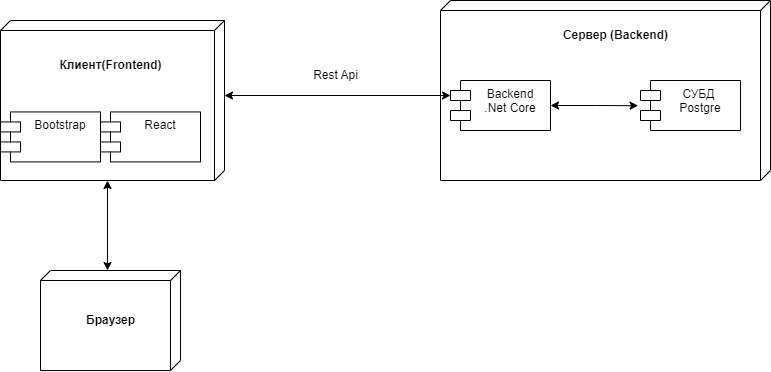 

 

## Реализованный функционал
- Регистрация
- Авторизация
- Аутентификация 
- Выход из системы
- Удаление аккаунта
- Изменение аккаунта 
- Выдача ленты постов подписок
- Выдача новых постов пользователей
- Создание поста
- Удаление поста
- Лайкнуть пост
- Убрать ранее поставленный лайк
- Стать подписчиком пользователя
- Просмотреть список лайков на посте
- Просмотреть список подписчиков
- Просмотреть список подписок 
- Просмотреть посты конкретного пользователя
- Найти страницу пользователя по его никнейму

 

## Основные экранные формы

 

  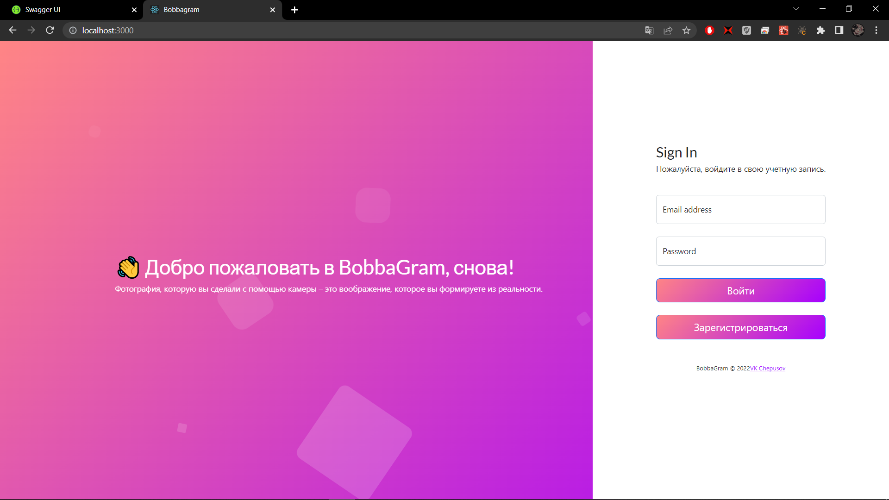  Страница входа в систему

 

  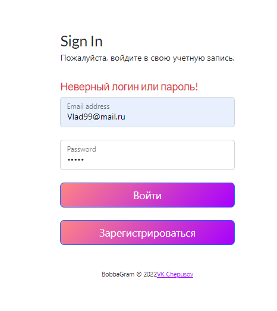  Неудачная попытка входа

 

  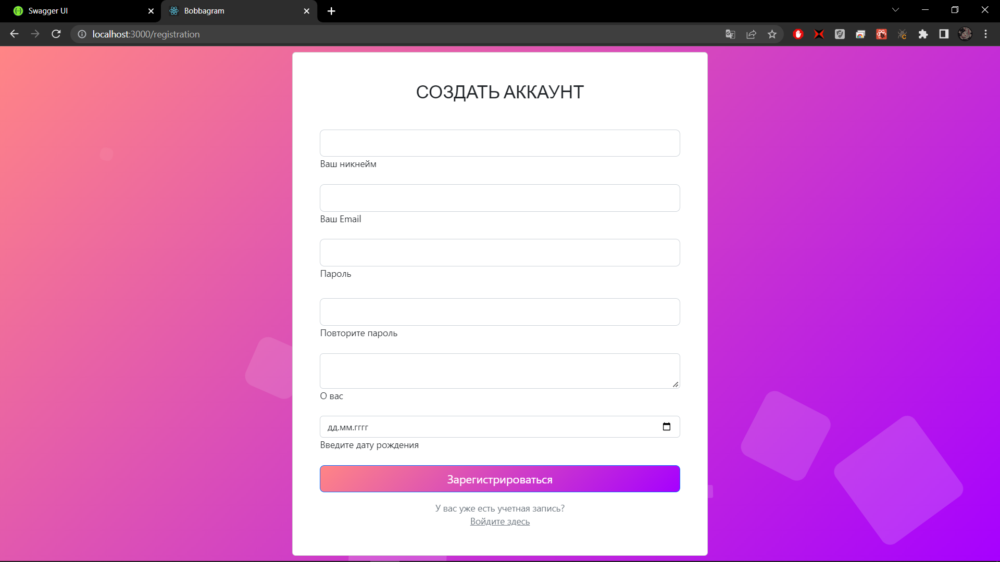  Страница регистрации

 

  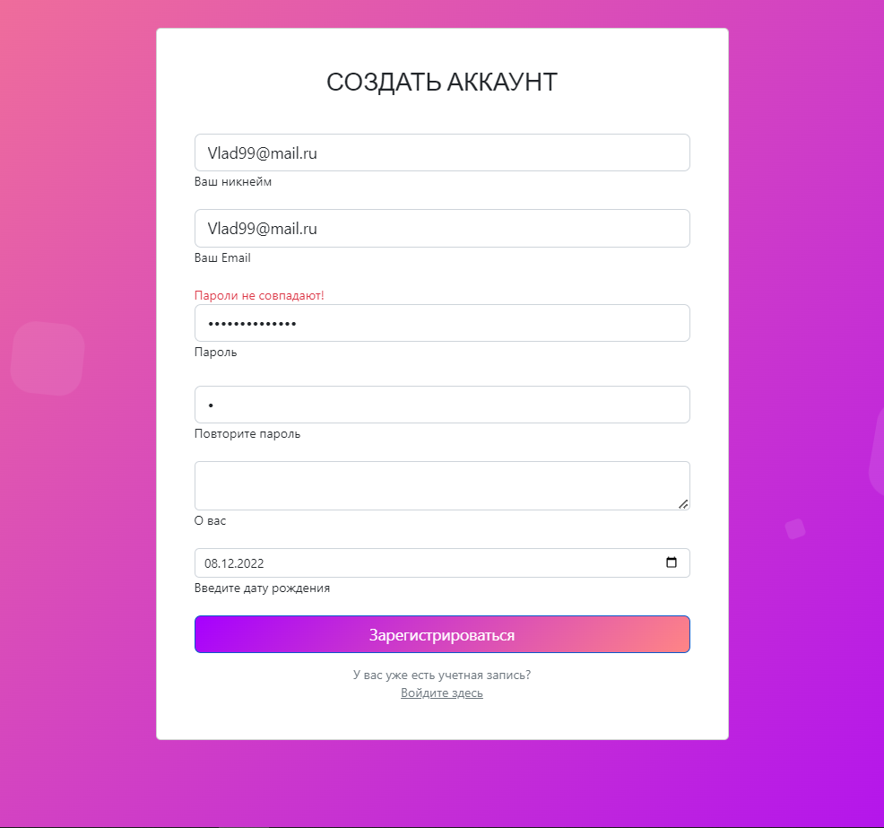  Валидация пароля при регистрации

 

  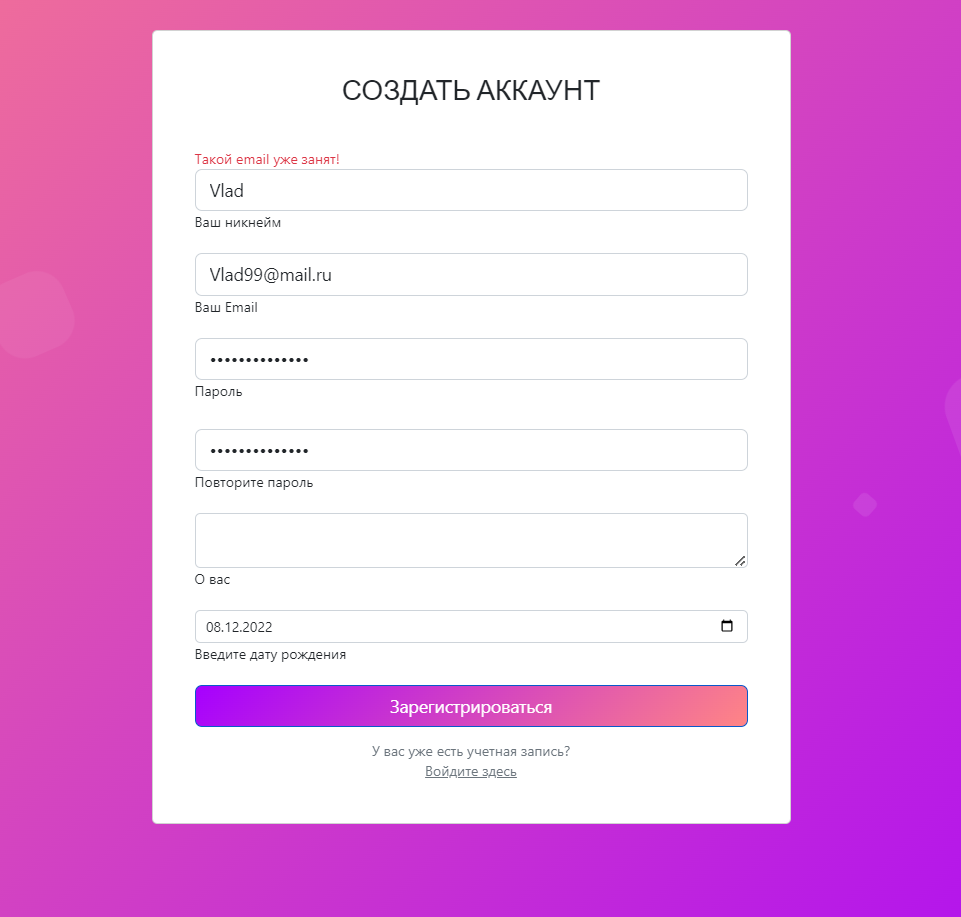  Валидация почты при регистрации

 

  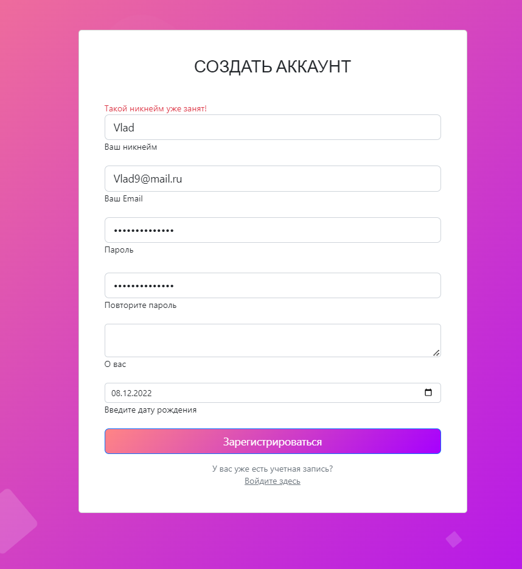  Валидация ника при регистрации

 

  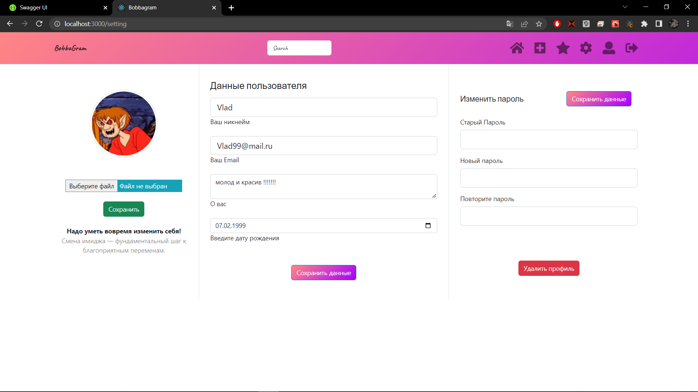  Страница настроек профиля

 

  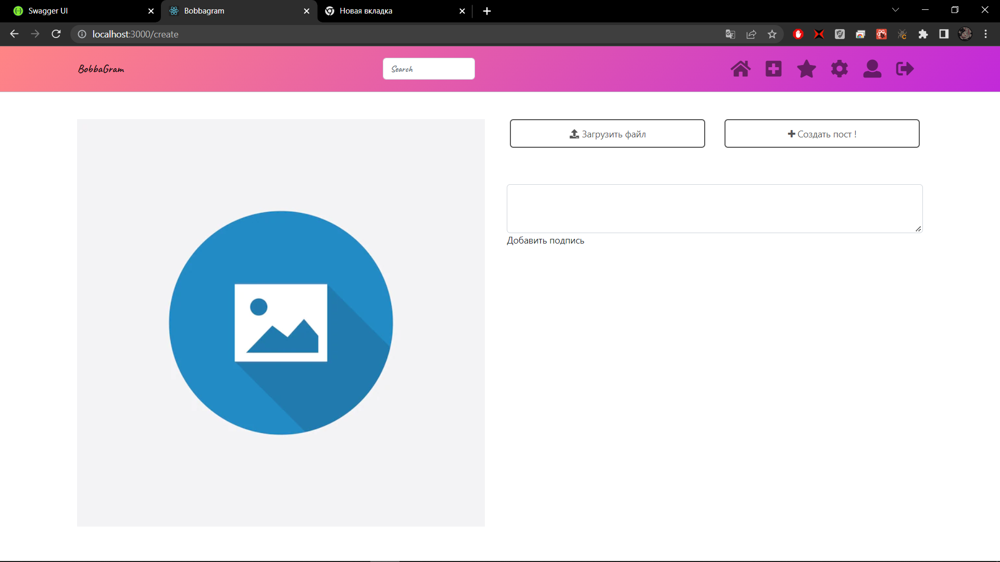  Cтраница создания поста

 

  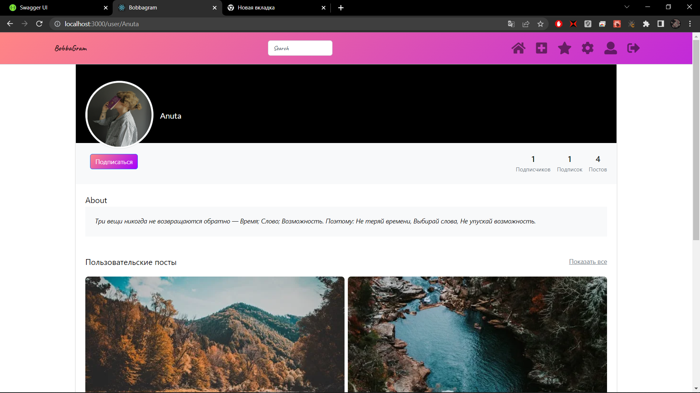  Страница пользователя

 

  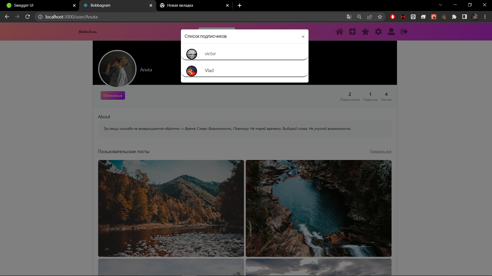  Cписок подписчиков

 

  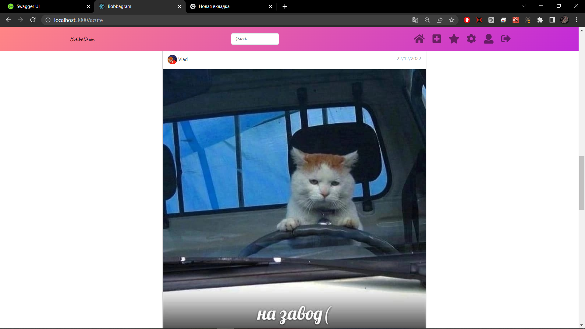  Страница ленты постов 

 

  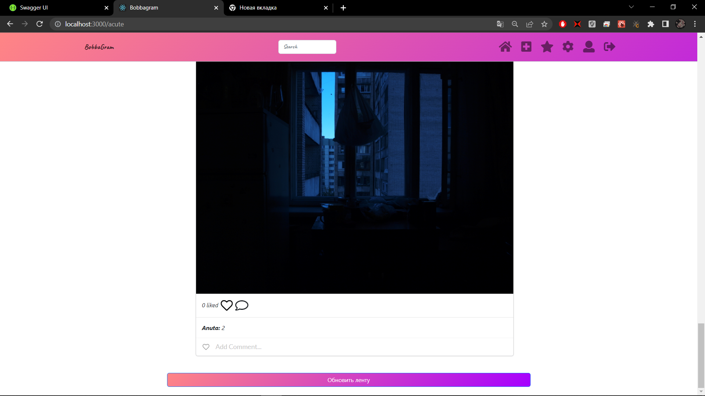  Страница ленты постов 

 

  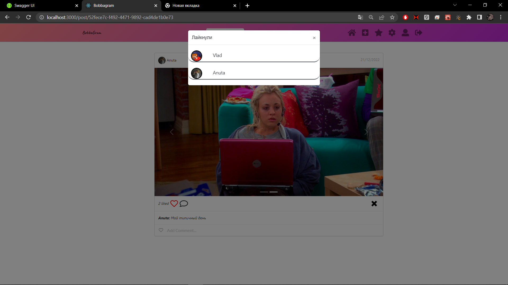  Страница конкретного поста / просмотр лайков поста

 

  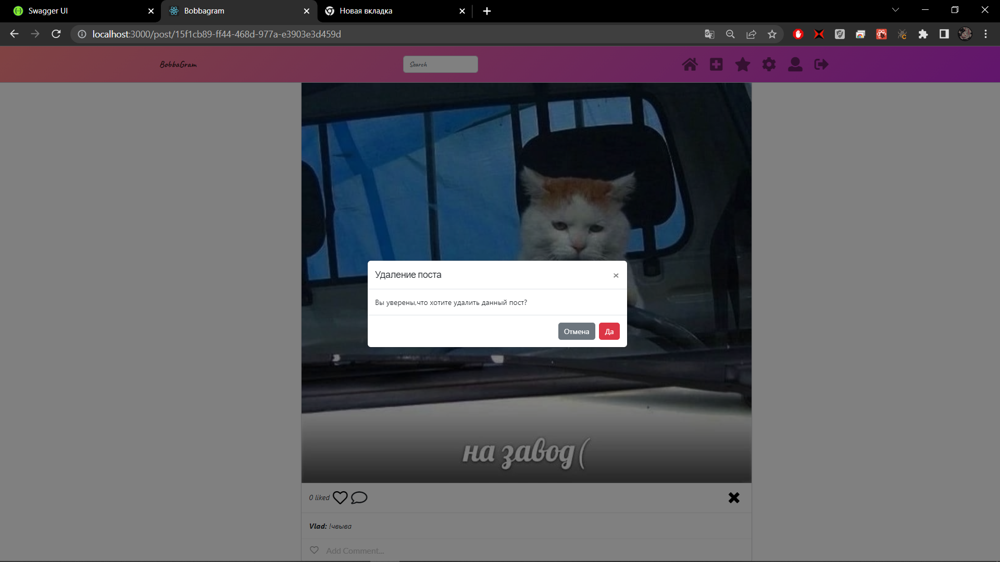  Удаление поста

